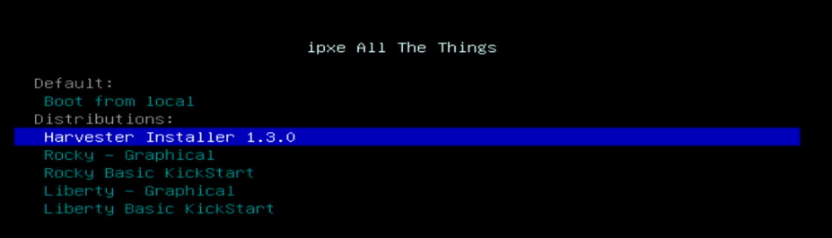
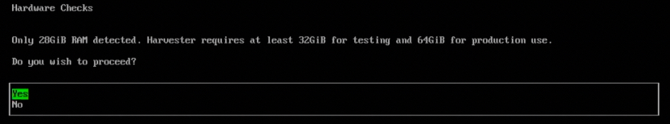
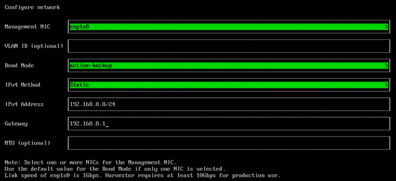
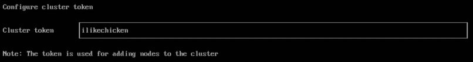
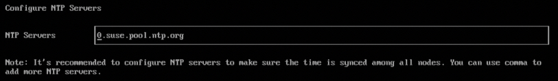
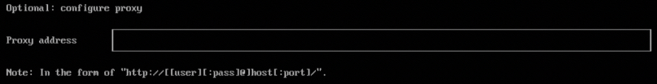
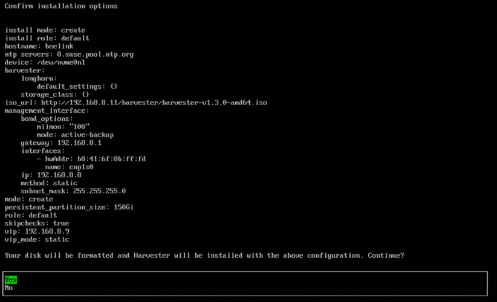
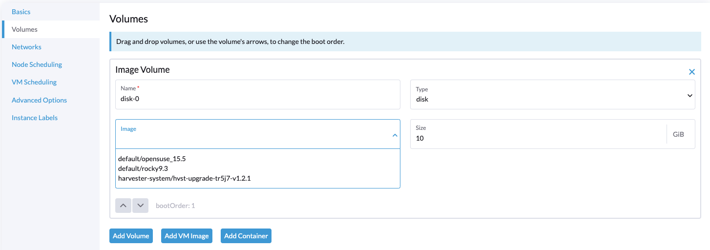

# Harvester Workshop


## Agenda

* Individually Build a Single Node Cluster
  * Install
  * Setup Networking
  * Add OS QCOW2
  * SSH Key
  * Setup Cloud-Init
  * Boot VMs
* Break
* Setup Class Cluster
  * Install
  * Add Additional Nodes
  * Setup Networking
  * Add OS QCOW2
  * SSH Key
  * Setup Cloud-Init
  * Boot VMs
* Profit

## Hardware

Basic minimum 16gb of ram and 8 cores PER node. 1, 3, or 5 nodes is ideal. As fast as networking as possible.

## Background

Harvester is a modern Hyperconverged infrastructure (HCI) solution built for bare metal servers using enterprise-grade open source technologies including Kubernetes, KubeVirt and Longhorn. Designed for users looking for a cloud-native HCI solution, Harvester is a flexible and affordable offering capable of putting VM workloads on the edge, close to your IoT, and integrated into your cloud infrastructure.

[Walk Through Video](https://www.youtube.com/watch?v=Ngsk7m6NYf4)?

[Watch the manual install video](https://youtu.be/mLXrSW8DCfk)?

The docs have a [config example](https://docs.harvesterhci.io/v1.3/install/harvester-configuration/) if you are looking to install via PXE.

## PXE Install Steps

If you want USB/ISO check the docs: https://docs.harvesterhci.io/v1.3/install/usb-install  
**ISO** : https://releases.rancher.com/harvester/v1.3.0/harvester-v1.3.0-amd64.iso

### Network - iPXE <-- Workshop

For the workshop we are going to use PXE booting since it is a little faster.  
Check the PXE docs for how to set it up https://docs.harvesterhci.io/v1.3/install/pxe-boot-install.  
There may be a https://gist.github.com/clemenko/8df23cb764b326defcb4624b58ab4da2 for setting it up.  
Select Network Boot on the device. --> `Harvester Installer 1.3.0`



#### Hardware Check

You may see a Hardware Check if there is not enough resources. Don't panic, proceed.  

  

#### Installation Mode

If this is the first node choose `Create a new Harvester cluster`.  

  

#### Installation Disk

Since we are using smaller hardware for the workshop we will only see one drive. Please pay attention to the Persistent size. This is partition is used for images and other system data. NOT VM data. In production split the volumes.  

  

#### Hostname

Pick a fun hostname!  

  

#### Network

For the workshop we are going to use a static IP in the 192.168.8.X range. Select the NIC that is `up`.  

  

**Harvester requires at least 10Gbps for production use!**  
VLAN ID = `null`  
Bond Mode = `Active-Backup`  
IPv4 Method = `Static`  
MTU = `null`  



#### DNS Servers

Pick a local or remote DNS server.  

  

#### Configure VIP

We have a couple options for the VIP. I tend to use another static. For the workshop we can use `DHCP`. The VIP is a floating IP for the cluster for use with HA. Since the first part of the workshop is single node clusters it is not needed.  

  

#### Cluster Token

Pick a cluster token.  

  

#### Admin Password

Pick an admin password. I like `Pa22word`.  

  

#### NTP

Enter a local NTP if we have one. Or use the default is the node is online.  

  

#### Proxy

If we need a proxy to reach the internet we can enter it here.  

  

#### Remote Config

Harvester can load additional configs from an http service.  
Feel free to look at the [config example docs](https://docs.harvesterhci.io/v1.2/install/harvester-configuration/). This can be 100% automated with iPXE.  

  

#### Confirm Installation

Now we can confirm all the settings.  



#### Wait

This step can take a few minutes. The installer is formatting the drive and unpacking all the bits.  
Be patient.  
The node will reboot.
It will take some more time for Harvester to be `Ready`.


### Log In

Navigate to the IP of the your node on https.  
Bootstrap Password = `Pa22word` or whatever you set it to before.  
Copy the new password.  
Uncheck `Allow collection...`
Check the EULA.

  

### Light Mode

Since you are not crazy you can enable light mode in the Upper Right hand corner. Click the icon and then go to `Preferences`.

## Setup Networking

First thing we need to do is setup the networking. In an enterprise situation we would isolate the data and management traffic to separate NICs. We need to create a network for the VMs to talk out.  
We need to navigate `Networks` --> `VM Networks`.  
Here we are going to `Create` an `UntaggedNetwork` named `vlan1` network with a Cluster Network of `mgmt`.

  

## Add QCOW2

Now that we have networking setup we need an QCOW2 to boot with.  
Navigate to `Images` and select `Create`.  
Give it a descriptive name and paste in the URL.
If our nodes are on the internet and have good bandwidth we can use:  
Name = `rocky9`  
URL = `https://dl.rockylinux.org/pub/rocky/9/images/x86_64/Rocky-9-GenericCloud-Base.latest.x86_64.qcow2`


## SSH Key

We have a few options when it comes to SSH Keys. We can add it to Harvester under `Advanced` --> `SSH Keys`.


Or we can use [cloud-init](https://cloudinit.readthedocs.io/en/latest/) for configuring the OS's as they boot up.

## Setup Cloud-Init

One of the nice features of Harvester is that it fully supports cloud-init. With this we can create templates for the VMs.  
Navigate to `Advanced` --> `Templates` and create a new one.

**Basic**
Name = `rocky`  
CPU = `2`  
Memory = `4`  
SSHKey = Select the one you created or leave blank.


**Volumes**  
Image = `rocky9`
Size = `60` 



**Networks**  
Network = `default/default`


**Advanced Options**  
We have two options here. If we intend to create a lot of templates can use the individual templates.  
Or we can use the `UserData` section by itself.  

Here is a version that includes an ssh key for the root account.
```bash
#cloud-config
disable_root: false
packages:
  - vim
  - sudo
  - epel-release
  - bind-utils
  - qemu-guest-agent
runcmd:
  - - sysctl
    - -w
    - net.ipv6.conf.all.disable_ipv6=1
ssh_pwauth: True
users:
  - name: root
    hashed_passwd: $6$fgls6Nv/5eS$iozPi2/3f9SE7cR5mvTlriGkRZRSuhzFs0s6fVWzUXiL19E27hVgAo3mZwCdzlDsiUq1YRJeyPtql6FkPhMZP0
    lock_passwd: false
    shell: /bin/bash
    ssh_authorized_keys:
      - ssh-rsa AAAAB3NzaC1yc2EAAAABIwAAAQEA26evmemRbhTtjV9szD9SwcFW9VOD38jDuJmyYYdqoqIltDkpUqDa/V1jxLSyrizhOHrlJtUOj790cxrvInaBNP7nHIO+GwC9VH8wFi4KG/TFj3K8SfNZ24QoUY12rLiHR6hRxcT4aUGnqFHGv2WTqsW2sxz03z+W1qeMqWYJOUfkqKKs2jiz42U+0Kp9BxsFBlai/WAXrQsYC8CcpQSRKdggOMQf04CqqhXzt5Q4Cmago+Fr7HcvEnPDAaNcVtfS5DYLERcX2OVgWT3RBWhDIjD8vYCMBBCy2QUrc4ZhKZfkF9aemjnKLfLcbdpMfb+r7NwJsVQSPKcjYAJOckE8RQ== clemenko@clemenko.local
  - name: rancher
    hashed_passwd: $6$fgls6Nv/5eS$iozPi2/3f9SE7cR5mvTlriGkRZRSuhzFs0s6fVWzUXiL19E27hVgAo3mZwCdzlDsiUq1YRJeyPtql6FkPhMZP0
    lock_passwd: false
    shell: /bin/bash
    sudo: ALL=(ALL) NOPASSWD:ALL
```


**Now we can click Create** to save.

## Boot VMS

We are now ready to boot some VMs.  
Navigate to `Virtual Machines` and click create.  
We can now check the `Use VM Template` button and select the `rocky` one we created.  
The nice thing is that we can change/override the template settings here.


Once booted we can interact with the VM is a couple of ways. SSH is the best, but Harvester also has a remote console that can be used.


The good news is that we can leverage the `hashed_passwd` to log into the vm. Please keep in mind that if you disconnect before logging out the next time we connect it will have the same session.


## Advanced Topics - Optional

### Password Reset

If you have a GUI that won't take your password see if you can `ssh` into the node. Once `ssh`'d in run.

```bash
kubectl  -n cattle-system exec $(kubectl -n cattle-system get pods -l app=rancher --no-headers | head -1 | awk '{ print $1 }') -c rancher -- reset-password
```

### Harvester cli

There is a beta cli available at https://github.com/belgaied2/harvester-cli.

To config the cli we need to create `~/.harvester/config`. Note the `insecure-skip-tls-verify: true` as a workaround the x509 issues.

```yaml
clembookair:clemenko rke2 $ cat ~/.harvester/config 
apiVersion: v1
kind: Config
clusters:
- name: "local"
  cluster:
    server: "https://192.168.1.9/k8s/clusters/local"
    insecure-skip-tls-verify: true

users:
- name: "local"
  user:
    token: "kubeconfig-user-qzwhg59plf:qd7rvhhmmpqcfghvgpwt8b8wd4k8dqsscvvttq2fdhpp49wsfl89kn"

contexts:
- name: "local"
  context:
    user: "local"
    cluster: "local"

current-context: "local"
```

Another way is to use an environment variable.  
`export HARVESTER_CONFIG=/Users/clemenko/Desktop/local.yaml`


There is a bug right now in the cli that requires a `Network` named `vlan1`. Just add it even though it is not used.

### PXE & iPXE

Harvester can be booted and installed from PXE and iPXE. I have some notes in this repo and in https://github.com/clemenko/harvester-equinix-metal.  
Please keep in mind that the nodes and terraform are alpha!

iPXE is also an option for netbooting remotely. Here are some good examples : https://github.com/harvester/ipxe-examples/tree/main/general.

### Harvester Registry Credentials

Harvester can take advantage of the containerd credentials for registries.

To view you can hit the backtick key to get a console "\`". Then enter `kubectl  get settings containerd-registry -o yaml` 

```bash
cat << EOF | kubectl apply -f - 
apiVersion: harvesterhci.io/v1beta1
kind: Setting
metadata:
  name: containerd-registry
value: '{"Mirrors":{"rgcrprod.azurecr.us":{"Endpoints":["rgcrprod.azurecr.us"],"Rewrites":null}},"Configs":{"rgcrprod.azurecr.us":{"Auth":null,"TLS":{"CAFile":"","CertFile":"","KeyFile":"","InsecureSkipVerify":false}}},"Auths":null}'
EOF
```

## More Resources

**https://rfed.io/links**

## Profit


