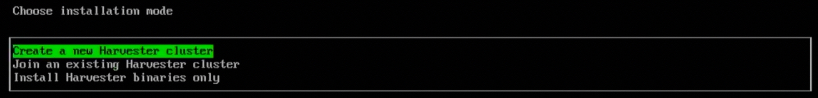
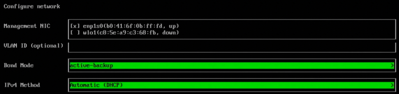
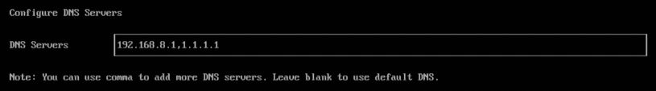

# Harvester Workshop


## Agenda

* Individually Build a Single Node Cluster
  * Install
  * Setup Networking
  * Add OS QCOW2
  * Setup Cloud-Init
  * Boot VMs
* Break
* Setup Class Cluster
  * Install
  * Add Additional Nodes
  * Setup Networking
  * Add OS QCOW2
  * Setup Cloud-Init
  * Boot VMs
* Profit

## Hardware

Basic minimum 32gb of ram and 8 cores PER node. 1, 3, or 5 nodes is ideal. As fast as networking as possible. 

## Install

[What is Harvester](https://www.youtube.com/watch?v=Ngsk7m6NYf4)?

[Watch the manual install video](https://youtu.be/mLXrSW8DCfk)?

The docs have a [config example](https://docs.harvesterhci.io/v1.2/install/harvester-configuration/) if you are looking to install via PXE.

We are going to use the [USB install docs](https://docs.harvesterhci.io/v1.2/install/usb-install). From a [Ventoy](http://ventoy.net/) thumb drive.

**ISO** : https://releases.rancher.com/harvester/v1.2.1/harvester-v1.2.1-amd64.iso

## Manual Install Steps

### Boot from ISO

Select the Harvester ISO.  
  
Select `Boot in normal mode`.

### Installation Mode

If this is the first node choose `Create a new Harvester cluster`.  
  

### Installation Disk Selection

For the workshop we are going to use the `nvme` drive. In production we should split the boot and the data drives.  
  

### Data Disk Selection

For the workshop we only have 1 drive. `Use the installation disk...`
  

### Hostname

Pick a fun hostname!  
  

### Network

For the workshop we are going to use a static IP in the 192.168.X.X range. Select the NIC that is `up`.  
  

VLAN ID = `null`  
Bond Mode = `Active-Backup`  
IPv4 Method = `Static`  
MTU = `null`  


### DNS Servers

Pick a local or remote DNS server.  
  

### Configure VIP

We have a couple options for the VIP. I tend to use another static. For the workshop we can use `DHCP`. The VIP is a floating IP for the cluster for use with HA. Since the first part of the workshop is single node clusters it is not needed.  
  

### Cluster Token

Pick a cluster token.  
  

### Admin Password

Pick an admin password. I like `Pa22word`.  
  

### NTP

Enter a local NTP if we have one. Or use the default is the node is online.  
  

### Proxy

If we need a proxy to reach the internet we can enter it here.  
  

### Pre-Load SSH Keys

Harvester can load ssh keys from any https service.  
  

### Remote Config

Harvester can load additional configs from an http service.  
Feel free to look at the [config example docs](https://docs.harvesterhci.io/v1.2/install/harvester-configuration/).  
  

### Confirm Installation

Now we can confirm all the settings.  


### Wait

This step can take a few minutes. The installer is formatting the drive and unpacking all the bits.  
Be patient.  
The node will reboot.
We can remove the thumb drive.
It will take some more time for Harvester to be `Ready`.


## Setup Networking

## Add QCOW2


## Cloud Init Template
```bash
#cloud-config
package_update: true
disable_root: false
ssh_pwauth: true
packages:
  - vim
  - sudo
  - epel-release
  - bind-utils
  - qemu-guest-agent
runcmd:
#  - - systemctl
#    - enable
#    - --now
#    - qemu-guest-agent.service
  - - sysctl
    - -w
    - net.ipv6.conf.all.disable_ipv6=1
users:
  - name: root
    hashed_passwd: $6$fgls6Nv/5eS$iozPi2/3f9SE7cR5mvTlriGkRZRSuhzFs0s6fVWzUXiL19E27hVgAo3mZwCdzlDsiUq1YRJeyPtql6FkPhMZP0
    lock_passwd: false
    shell: /bin/bash
  - name: rancher
    hashed_passwd: $6$fgls6Nv/5eS$iozPi2/3f9SE7cR5mvTlriGkRZRSuhzFs0s6fVWzUXiL19E27hVgAo3mZwCdzlDsiUq1YRJeyPtql6FkPhMZP0
    lock_passwd: false
    shell: /bin/bash
    sudo: ALL=(ALL) NOPASSWD:ALL
```

## Boot VMS


## image 

https://dl.rockylinux.org/pub/rocky/9/images/x86_64/Rocky-9-GenericCloud-Base.latest.x86_64.qcow2


### harvester cli

https://github.com/belgaied2/harvester-cli
export HARVESTER_CONFIG=/Users/clemenko/Desktop/local.yaml


### ipxe

[https://github.com/harvester/ipxe-examples](https://github.com/harvester/ipxe-examples)

